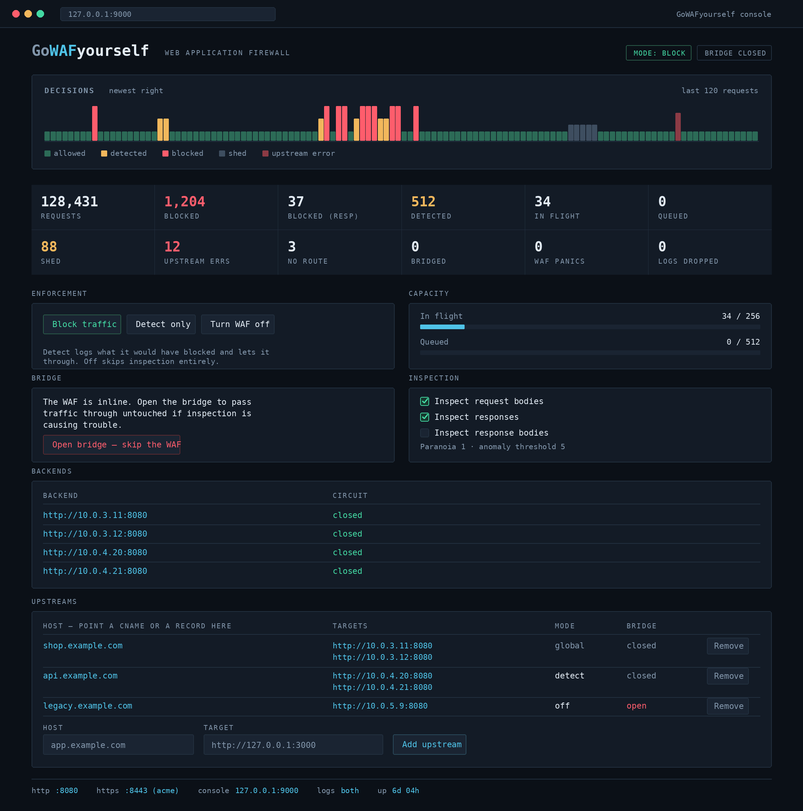
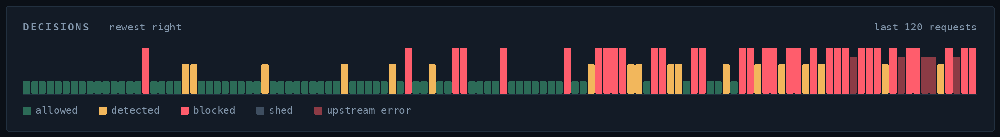
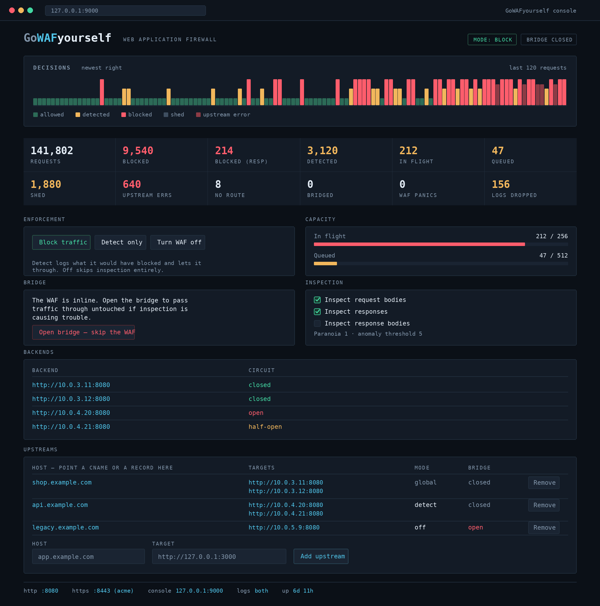
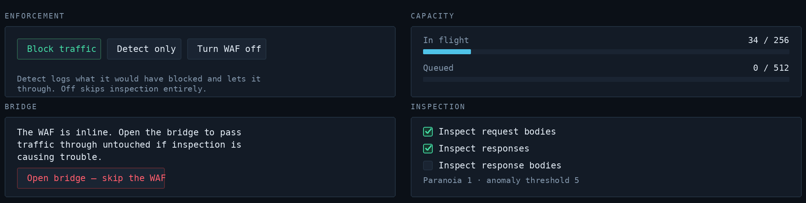

<div align="center">

# GoWAFyourself

**A self-contained Web Application Firewall reverse proxy, in Go.**

Inspects traffic with the OWASP Core Rule Set, load balances across healthy
backends, sheds load past capacity, ships decision logs to disk or S3 — and puts
all of it behind a live control console.

Single static binary · hot-reloadable · `block` / `detect` / `off` · request &
response inspection

</div>



> **Status: MVP.** Please read the [caveats](#caveats-read-this) before
> deploying — most importantly, this source has not yet been compiled (caveat 1).
> The images here are rendered from the console's own design; the project has not
> been run.

---

## The signature: a decision strip

The console is built like an instrument panel, not a dashboard. Everything is
monospace because everything on it is data, and colour is spent only on verdict
meaning — never decoration. The strip across the top is **one tick per recent
request**; its height and colour encode what the WAF did with it. An attack or an
overload shows up as a *shape* before you read a single number.



Above, a scan is underway: the tall red ticks bunched at the right (newest) edge
are requests being blocked in real time, the amber ones are rule matches in
detect, and the short green baseline is normal traffic still getting through.

---

## Under load

Here is the same console with an attack in progress. Nothing changed in the
config — the WAF is simply doing its job, and the panel makes that legible at a
glance: blocked counts climbing, the capacity meter deep into the red at
212/256 in flight, two upstream circuits tripped (one `open`, one probing back
to life as `half-open`).



---

## What it does

- **WAF** — [Coraza](https://coraza.io/) + [OWASP CRS](https://coreruleset.org/)
  with `block` / `detect` / `off` modes, per-upstream overrides, a configurable
  paranoia level, **request and response phase** inspection, and a slot for your
  own SecLang rules (`rules/custom.conf`).
- **Reverse proxy** with **health-aware round-robin** across multiple backends
  per host.
- **Admission control** — a bounded concurrency limit plus a bounded wait queue;
  excess traffic is shed with `503` rather than collapsing the service. Tunable
  live from the console. *(Validated — see [validation](#validation).)*
- **Circuit breaker** per backend — a failing upstream is fast-failed and probed
  for recovery, so one sick backend doesn't condemn its healthy siblings.
- **Bridge** — a switch that passes traffic straight through, skipping the WAF,
  for when inspection is the thing causing trouble. It can trip automatically
  after *N* WAF panics, and WAF evaluation **fails open** on any internal error.
- **Logging** — asynchronous and **non-blocking** (it drops before it stalls
  traffic), to rotating JSONL on disk and/or gzipped NDJSON objects in S3.
- **TLS** — off, manual cert/key, or automatic Let's Encrypt via CertMagic.

Every control is live. Changes apply without dropping a connection.



---

## Build and run

Requires Go 1.23+ and network access **on your build machine** (to fetch modules).

```sh
tar xzf gowafyourself.tar.gz && cd gowafyourself
go mod tidy          # resolves dependencies, creates go.sum   (or: make deps)
make build           # produces ./bin/gowafyourself
make test            # run the unit tests
cp config.example.json config.json
# edit config.json — set a console password and your upstream
./bin/gowafyourself -config config.json
```

Proxied traffic lands on `:8080`; the console is on `127.0.0.1:9000`.

```sh
curl -H 'Host: localhost' 'http://127.0.0.1:8080/'
# a path-traversal probe should return 403 in block mode:
curl -H 'Host: localhost' 'http://127.0.0.1:8080/?x=../../etc/passwd'
```

Handy flags: **`-check`** validates the config *and* compiles the full rule set,
then exits — run it in CI so a bad rule fails the pipeline instead of the deploy.
**`-version`** prints the build version.

No Go installed? The included `Dockerfile` brings its own toolchain:

```sh
docker build -t gowafyourself .    # or: make docker
```

A systemd unit is in `deploy/gowafyourself.service` — it runs unprivileged, binds
80/443 via `CAP_NET_BIND_SERVICE`, and maps `systemctl reload` onto `SIGHUP`.

---

## Configuration

One JSON file; `config.example.json` is a complete template. Unknown keys are
rejected, so a typo is reported rather than silently ignored.

| Section | Key fields | Notes |
|---|---|---|
| `listen` | `http`, `https`, `panel` | Bind addresses. Keep `panel` on loopback in production. |
| `tls` | `mode` = `off`\|`manual`\|`acme` | `manual` needs `certFile`/`keyFile`; `acme` auto-issues per upstream host. |
| `upstreams[]` | `host`, `target` / `targets[]`, `waf`, `bypass` | Route by Host. `targets[]` enables round-robin. `waf:""` inherits the global mode. |
| `admission` | `maxConcurrent`, `queueSize`, `queueTimeoutMs` | Capacity and wait queue. Tunable live from the console. |
| `breaker` | `enabled`, `windowSize`, `errorThreshold`, `cooldownMs`, `minRequests` | Per-backend failure circuit. |
| `waf` | `mode`, `inspectBody`, `inspectResponse`, `inspectResponseBody`, `maxBodyBytes`, `maxResponseBodyBytes`, `paranoiaLevel`, `anomalyThreshold`, `customRulesPath`, `autoBypassOnPanics` | Rule tuning plus the bridge-on-panic safety valve. |
| `logging` | `sink` = `disk`\|`s3`\|`both`\|`stdout`\|`none`, `diskPath`, `rotateMB`, `s3{...}` | S3 uses the AWS default credential chain when `accessKeyId` is empty. |
| `panel` | `enabled`, `user`, `pass` | The console refuses every request until user and pass are set. |

### Modes and the bridge

- **block** — matched requests get `403`.
- **detect** — matches are logged and allowed through. The honest way to tune a
  new rule set before you enforce it.
- **off** — inspection skipped for that traffic.
- **bridge** — an *operational* switch (deliberately not persisted) that skips
  the WAF globally. Distinct from the **circuit breaker**, which is about
  upstream health, not inspection.

Switching between block/detect/off is cheap: the engine always runs enforcing and
the data plane decides what to do with an interruption, so no rules are
recompiled.

### Onboarding customers (CNAME or A record)

Point a DNS record at this proxy and add a matching `upstreams` entry keyed by
that hostname. Routing is on the **Host header / SNI**, so a **CNAME** and an **A
record** behave identically. The console shows the host to point at.

---

## Logging

One JSON record per decision: timestamp, client, host, method, path, action
(`allow`/`block`/`detect`/`queue_rejected`/`no_route`/`upstream_error`), which
phase matched, rule id and message, status, backend, latency, and bytes. Disk
output is rotating JSONL; S3 output is time-partitioned gzipped NDJSON
(`<prefix>/YYYY/MM/DD/HH-MM-SS-<rand>.ndjson.gz`). **SigV4 signing is handled by
the AWS SDK** — there is no hand-rolled cryptography here.

---

## Operating

- **Console** — traffic decisions, mode, bridge, capacity, upstreams.
- **Hot reload** — `kill -HUP <pid>` re-reads `config.json` and re-applies
  routing, breaker, and capacity settings without dropping connections. The rule
  engine is rebuilt only when a rule-affecting setting changed; the custom rules
  file is fingerprinted by **content**, so editing rules in place and sending
  `SIGHUP` picks up the change.
- **Shutdown** — `SIGINT`/`SIGTERM` drains in-flight requests and flushes logs.

---

## Caveats (read this)

1. **Not compiled or run.** This source was written in an environment with no Go
   toolchain and no access to module hosts, so a clean *first* `go build` is not
   guaranteed — expect to fix the occasional import or API-signature nit. The
   design and wiring are complete and internally consistent; treat first
   compilation as a normal integration step, not a rewrite. The console images in
   this README are rendered from its design (`docs/gen_mockup.py`), not captured
   from a running instance.
2. **Coraza / CRS version specifics.** The two things most likely to need a tweak
   for your exact dependency versions are both commented in
   `internal/waf/waf.go`: the CRS include names (`@coraza.conf-recommended`,
   `@crs-setup.conf.example`, `@owasp_crs/*.conf`) and the paranoia-level TX
   variable names (`tx.blocking_paranoia_level` and friends, which are CRS v4
   names).
3. **Response body inspection costs memory.** Enabling `inspectResponseBody`
   buffers up to `maxResponseBodyBytes` per in-flight response — budget roughly
   `maxConcurrent × maxResponseBodyBytes` worst case before turning it on.
   Response *header* inspection (`inspectResponse`) is cheap by comparison.
4. **Capacity resize has a small transient.** Shrinking `maxConcurrent` while
   requests are releasing can leave the effective ceiling briefly above the new
   limit, by at most the number of concurrent releases. It self-corrects as the
   shrink drains — a deliberate trade to keep the release path (hit on every
   request) lock-free.
5. **CertMagic API drift.** The ACME setup follows the current
   `caddyserver/certmagic` release; adjust if you pin a very different version.

## Not in v1 (deferred)

- **Authoritative DNS / custom nameservers.** Running your own nameservers so
  customers delegate to you, rather than pointing a CNAME or A record, is a
  substantial subsystem of its own and is deliberately out of scope. CNAME/A
  onboarding is the supported path.
- **Active health checks.** Backend health is inferred passively from real
  traffic via the circuit breaker; there are no out-of-band probes.
- **Distributed state.** Metrics, breaker state, and admission counters are
  per-process. Multiple instances behind an L4 balancer each keep their own, so
  the effective global concurrency limit is `maxConcurrent × instances`.

---

## Validation

Two layers, because they catch different things.

**Go unit tests** (`make test`) cover admission control, the circuit breaker,
config validation and round-tripping, the bounded body reader, and proxy routing
and backend selection — around 40 tests, run with `-race`.

**A standalone model** (`make validate`, or `python3 validate_concurrency.py`)
covers the pure concurrency logic — the part a compiler cannot check — with no Go
toolchain required:

```
Admission control:
  capacity: max_inflight=4 (cap 4), admitted=71, shed_full=121, shed_timeout=8
  timeout: stale waiters shed rather than admitted late
  grow: 2 -> 4 admitted immediately
  shrink: 4 -> 1 drained via debt, in-flight preserved, new ceiling enforced
  resize churn: 400 requests across 6 limit changes, no capacity leak
Circuit breaker:
  breaker: opens on faults, blocks during cooldown, probes, re-closes on recovery
  breaker: failed probe re-opens and restarts the cooldown
  breaker: isolated errors don't trip it
```

Writing that model paid for itself twice. It caught a real bug in the breaker's
half-open recovery — a successful probe failed to re-close the circuit because the
stale failure window still dominated the ratio, which would have left a recovered
backend fast-failing indefinitely. The fix is in `internal/breaker/breaker.go`,
guarded by `TestHalfOpenProbeCloses`. It then validated the token/debt scheme that
makes `maxConcurrent` resizable without interrupting in-flight requests. A third
bug — truncating oversized request bodies while forwarding them — was caught
reviewing `internal/waf/waf.go`, guarded by `TestBoundedReadOversizedForwardsEverything`.

---

## Project layout

```
cmd/gowafyourself/main.go     entry point: wiring, listeners, TLS, signals
internal/config/              schema, load/save, atomic hot-reload
internal/metrics/             lock-free counters + rolling verdict window
internal/admission/           resizable concurrency limit + wait queue
internal/breaker/             per-backend circuit breaker
internal/waf/                 Coraza + CRS engine, request & response phases
internal/logstore/            async pipeline + disk and S3 sinks
internal/proxy/               data plane (route → admit → inspect → balance → proxy → log)
internal/panel/               control console
rules/custom.conf             example site-specific rules
deploy/                       systemd unit
docs/                         console mockups + their generator
validate_concurrency.py       standalone model of the concurrency logic
```

Regenerate the console images with `make mockup` (writes the SVGs) followed by
`python3 docs/rasterize.py` (writes the PNGs), so they track any design change.
